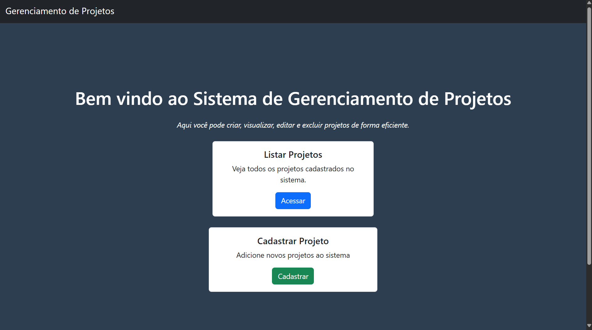
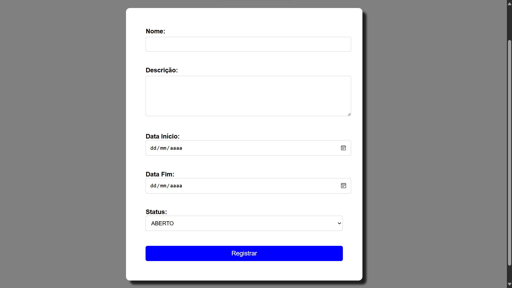
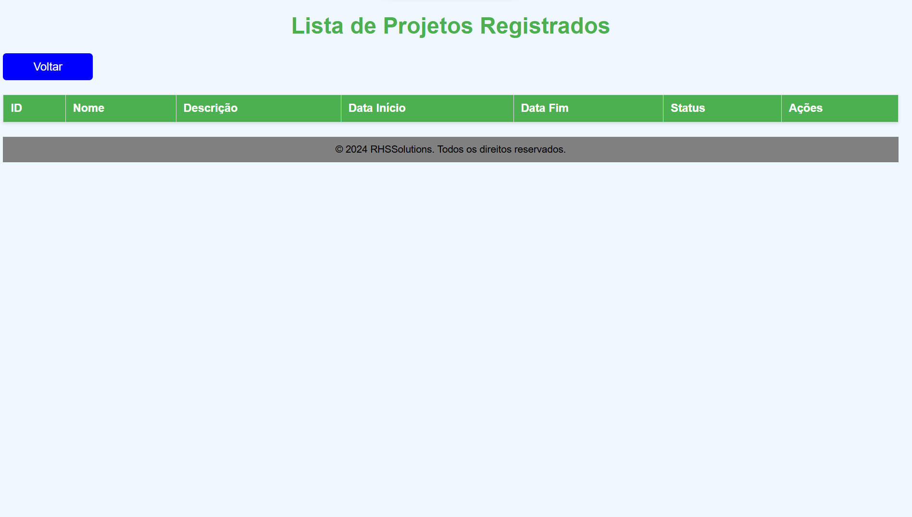

<h1 align="center"> Gerenciamento de Projetos</h1>
<p align="center"><em>API para cadastro de projetos</em></p>

## 🖥️ Tecnologias

          




## ⬇️Contribuições
```bash
# clone the project
$ git clone https://github.com/RafaSamm/GDProjetos.git

